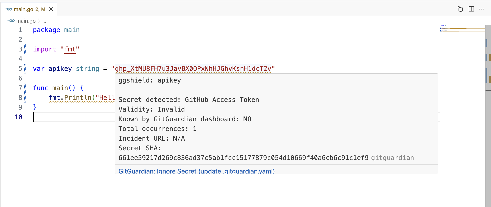

# GitGuardian's ggshield VSCode extension

## Table of contents

- [GitGuardian's ggshield VSCode extension](#gitguardians-ggshield-vscode-extension)
  - [Table of contents](#table-of-contents)
  - [Description](#description)
    - [Features](#features)
  - [Getting started](#getting-started)
    - [Requirements](#requirements)
    - [Installation](#installation)
    - [Configuration](#configuration)
    - [Scan for secrets](#scan-for-secrets)
    - [How to remediate incidents?](#how-to-remediate-incidents)
    - [Ignore secrets (only when working in a workspace)](#ignore-secrets-only-when-working-in-a-workspace)
    - [Check my quota](#check-my-quota)
  - [Support, Feedback, Contributing](#support-feedback-contributing)
  - [Release Notes](#release-notes)
  - [License](#license)

## Description

This extension helps you detect more than 350+ types of secrets, as well as other potential security vulnerabilities or policy breaks affecting your codebase, directly from VSCode using [ggshield](https://www.gitguardian.com/ggshield)) CLI application.

NB: The extension uses the quota of secret detection of your ggshield API token.

### Features

- When a file is opened or saved, it is scanned using the ggshield CLI application
- Found incidents are highlighted in code and available in the `Problems` panel as warnings

## Getting started

### Requirements

The extension requires `ggshield` to be installed. See [documentation](https://docs.gitguardian.com/ggshield-docs/getting-started) for more details on how to install and use it.

The current minimum version is *1.15.0*.

### Installation

To test the plugin, open this project with VSCode and press F5, a window called "Development Host" will open with the extension loaded.  
You then need to set up the extension settings.

Once released it will installed directly from the VS Code Marketplace.

### Configuration

- `ggshield.ggshieldPath`: Path to ggshield executable (use `$ where ggshield` to find out)
- `ggshield.apiKey`: GitGuardian Internal Monitoring API key
- `ggshield.apiUrl`: GitGuardian Internal Monitoring URL (default: <https://api.gitguardian.com/>)

### Scan for secrets

The scanning is triggered automatically when opening or saving a file. Incidents are highlighted in file and available in the `Problems` panel as warnings.

### How to remediate incidents?

For more info on how to remediate incidents, you can take a look at GitGuardian's [documentation](https://docs.gitguardian.com/internal-repositories-monitoring/remediate/remediate-incidents).

### Ignore secrets (only when working in a workspace)

Right after saving a file if incidents were found run the command `ggshield: Ignore last found incidents`.
This will create and fill the ggshield file `.gitguardian.yaml` at the root of the workspace and ignore the secrets found. See ggshield's [documentation](https://docs.gitguardian.com/ggshield-docs/reference/secret/ignore) for info.

### Check my quota

Run the command `ggshield: Show quota` from VSCode command palette to check the current status of your API quota.

## Support, Feedback, Contributing

This project is open to feature requests/suggestions, bug reports etc. via GitHub issues. Contribution and feedback are encouraged and always welcome. For more information about how to contribute, the project structure, as well as additional contribution information, see our Contribution Guidelines.

## Release Notes

See [Change log](./CHANGELOG.md)

## License

ggshield and this extension are MIT licensed.
